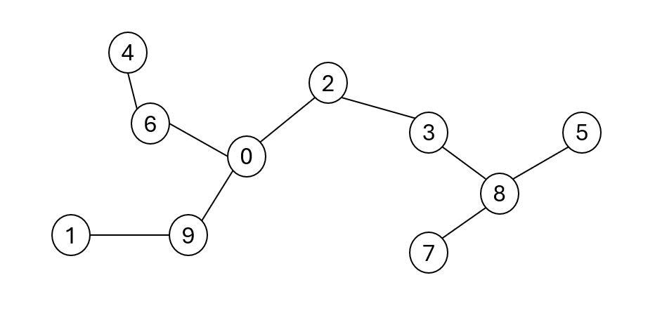
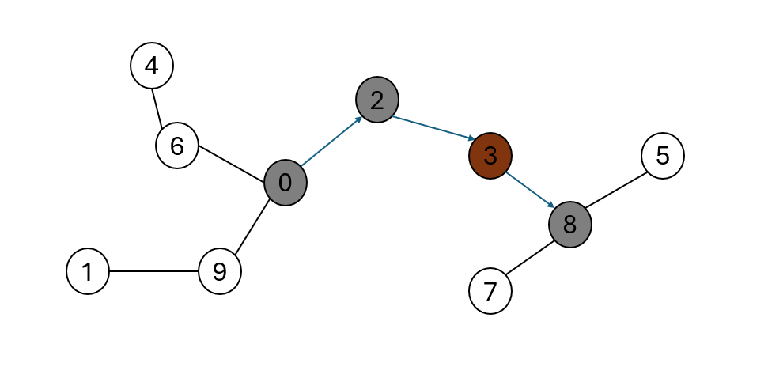

[![LinkedIn][linkedin-shield]][linkedin-url-Bucsa]

## Task 1

A network consisting of N citites and N-1 roads connecting them is given. Cities are labeled with distinct integers within the range [0... N-1].

Roads connect cities in such a way that each pair of distinct cities is connected either by a direct road or along a path conisting of direct roads. There is exactly one way to reach any city from any other city. In other words, cities and direct roads from a tree. 

For example, cosider the following network consisting of ten cities and nine roads:

<!-- Insert Image of Road Network -->


Jack lives in city number 0. He wants to plan a trip and visit as many cities as possible. Nonetheless, he does not want to visit any city more than once and he can only move along direct roads. The trip may finish in any city. 

There is one issue. Each city labeled with an odd number (1, 3, 5, ...) requires a special ticket in order to visit it. The tickets are already sold out, but luckily Jack has already bought one such ticket, so he can visit at most one odd-numbered city.

Jack wonder how many citites (including the starting one) he can visit. 

Write a function:

``` int solution(vector<int> &T)```

that, given a non-empty array T consisting of N integers describing a network of N cities and N-1 roads, returns the maximum number of cities that Jack can visit.

Array T describes a network of cities as follows:

- T[0] = 0;
- if T[P] = Q and P=/0, then there is a direct road between cities P and Q.
  
### Emamples:

1. Given T = [0, 9, 0, 2, 6, 8, 0, 8, 3, 0],



the function should return 4, as there is a path 0 -> 2 -> 3 -> 8. City number 3 is the only city which requires a ticket.

1. Given T = [0, 0, 0, 1, 6, 1, 0, 0],

<!-- Insert Images of Roadmap Example 2 -->


the function should return 3, as there is a path 0 -> 6 -> 4. There are no cities that require a ticket on the path.

### Solution

Write an efficient algorithm for the following assumptions:

- N is an integer within the range [1, ..., 100,000];
- each element of array T is an integer within the range [0, ..., N-1];
- there is exactly one (possibly indirect) connection between any two distinct cities. 


[linkedin-shield]: https://img.shields.io/badge/-LinkedIn-black.svg?style=for-the-badge&logo=linkedin&colorB=555
[linkedin-url-Bucsa]: https://www.linkedin.com/in/justin-bucsa