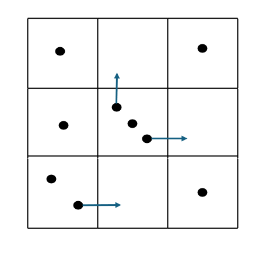
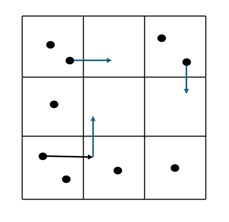
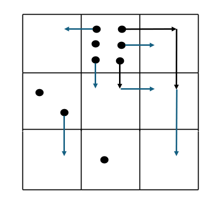

[![LinkedIn][linkedin-shield]][linkedin-url-Bucsa]

## Task 2

You are given a 3 x 3 grid which contains exactly nine stones within its cells. A cell may contain any number of stones. 

In each move, you can shift a stone from one cell to another if the two cells share a common side. 

The grid is described by a 3 x 3 matrix of integers A. Rows are numbered from 0 to 2 rom top to bottom. Columns are numbered from 0 to 2 from left to right. A[K][J] represents the number of stones in the cell located in the intersection of the Kth row and Jth column.

Write a function:

``` int solution(vector<int> &A)```

that given the matrix A, returns the minimum number of moves needed to place one stone in each cell. 

### Examples:

1. Given A =[[1, 0, 1], [1, 3, 0],  [2, 0, 1]], the function should return 3. We may shift a stone from (1, 1) to (0, 1), from (1, 1) to (1, 2) and from (2, 0) to (2, 1).

<!-- Example One Grid -->



2. Given A = [[2, 0, 2], [1, 0, 0], [2, 1, 1]], the function should return 4.




1. Given A = [[0, 6, 0], [2, 0, 0], [0, 1, 0]], the function should return 9.




### Solution

Write an efficient algorithm for the following assumptions:

- A has 3 rows and 3 columns;
- each element of matrix A is an integer within the range [0, 9];
- A contains exactly 9 stones. 

[linkedin-shield]: https://img.shields.io/badge/-LinkedIn-black.svg?style=for-the-badge&logo=linkedin&colorB=555
[linkedin-url-Bucsa]: https://www.linkedin.com/in/justin-bucsa